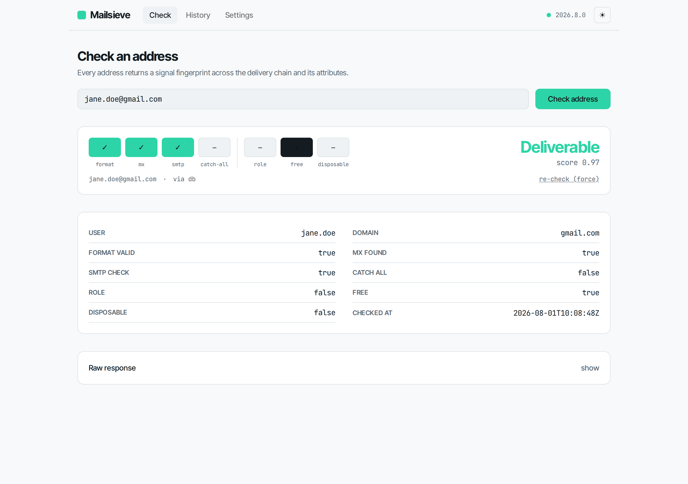
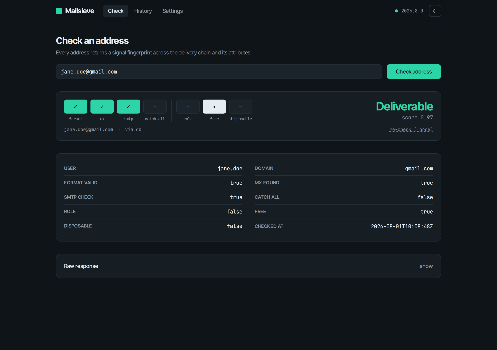
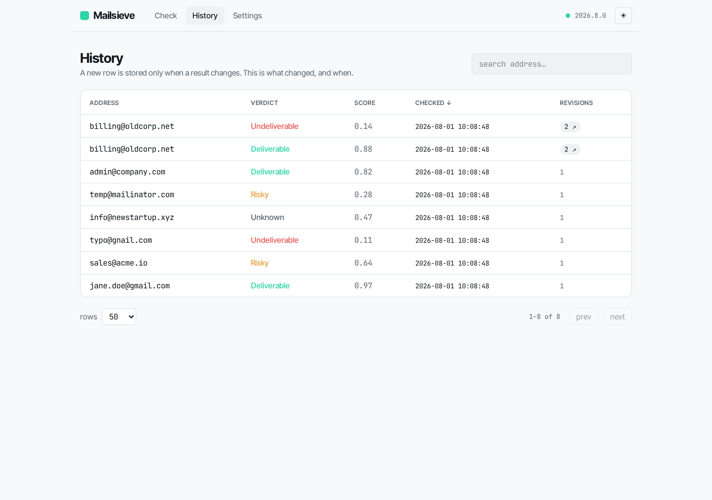
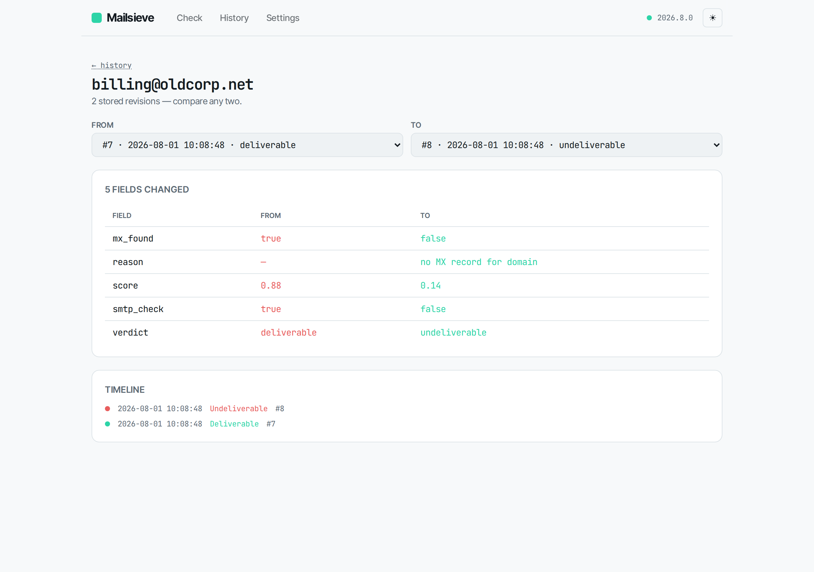
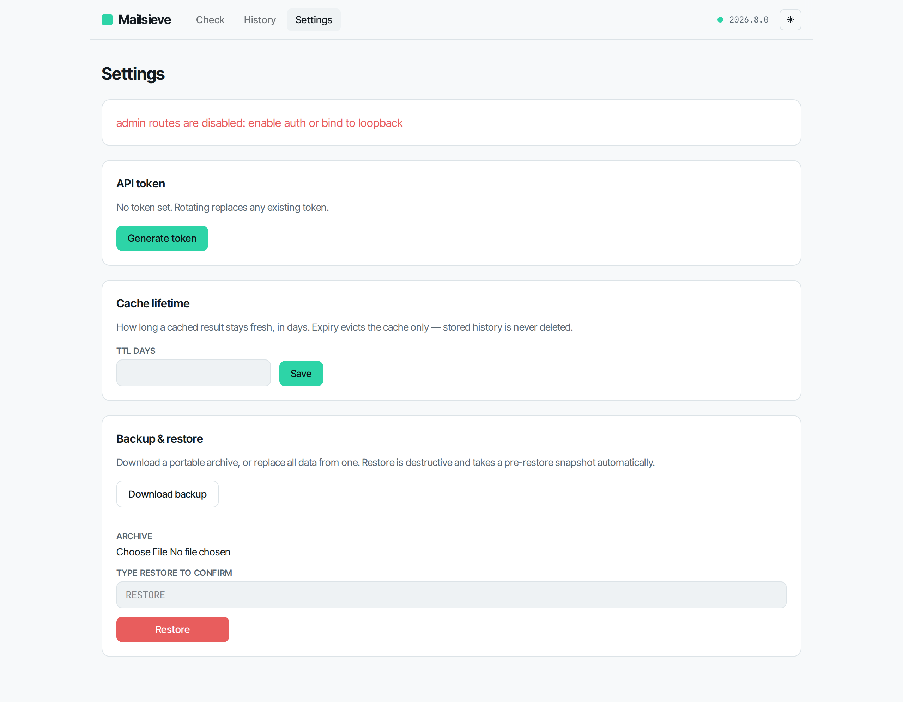

# Mailsieve

Self-hosted email validation API. Mailsieve verifies addresses through mailboxlayer's
verification endpoint, then caches, stores, and serves the results with a web UI and history.

## Quick start

```bash
cp config.example.yaml config/config.yaml
docker compose up -d
```

Open http://localhost:8080 for the UI, http://localhost:8080/api/docs for the API.

## Screens

### Check

Every address renders as a **signal strip** — a fixed row of cells across the delivery
chain (`format · mx · smtp · catch-all`) and its attributes (`role · free · disposable`),
so each address produces a recognisable left-to-right fingerprint. The verdict sits large
in its own colour, with `score` as a secondary figure.




### History

Results are stored append-only and paginated server-side. A revision badge links to the
diff for any address checked more than once.



### Diff

Two revisions side by side, changed fields highlighted, with a timeline of every revision —
this is why the table is append-only.



### Settings

Generate/rotate the API token (shown once), adjust the cache TTL, and download or restore a
portable backup.



## How it works

For each address Mailsieve fetches mailboxlayer's rotating request secret, hashes it with the
address, and calls the verification endpoint through a rotating pool of proxies and
user-agents. Results are cached in Redis, stored append-only in the database, and returned
with a derived verdict.

This verification path was disclosed to mailboxlayer, who confirmed the usage is permitted.
It still depends on their endpoint's current shape, which can change without notice — the
service isolates every moving part behind one provider module and reports upstream
reachability at `/api/v1/health`.

## Operating notes

- **Free proxies are unreliable.** Throughput is bounded by proxy health; the pool refreshes
  on an interval and rotates on failure. For steady throughput, point `proxies.source_url` at
  a better pool or supply your own.
- **Be a good guest.** The built-in politeness limits (concurrency + minimum spacing) exist to
  keep the sanctioned access healthy. Leave them on.

## History

Results are stored append-only. Re-validating an address writes a new row **only when the
result has changed**, so the history table is a record of what changed and when, not a log of
every check. The diff view compares any two revisions.

## Licence

Apache-2.0
