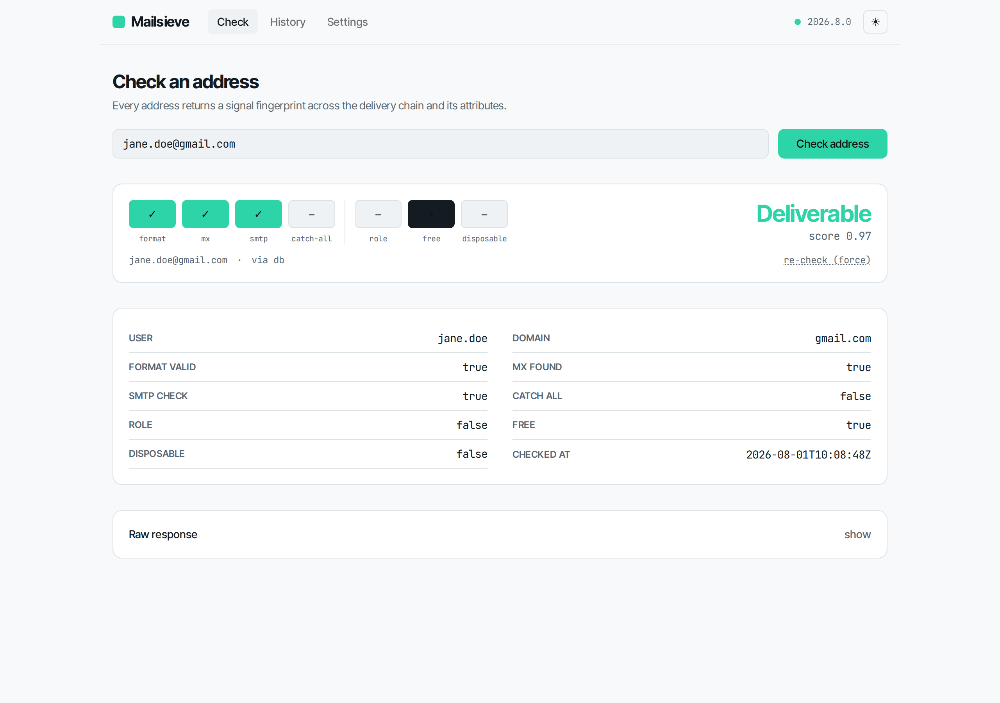
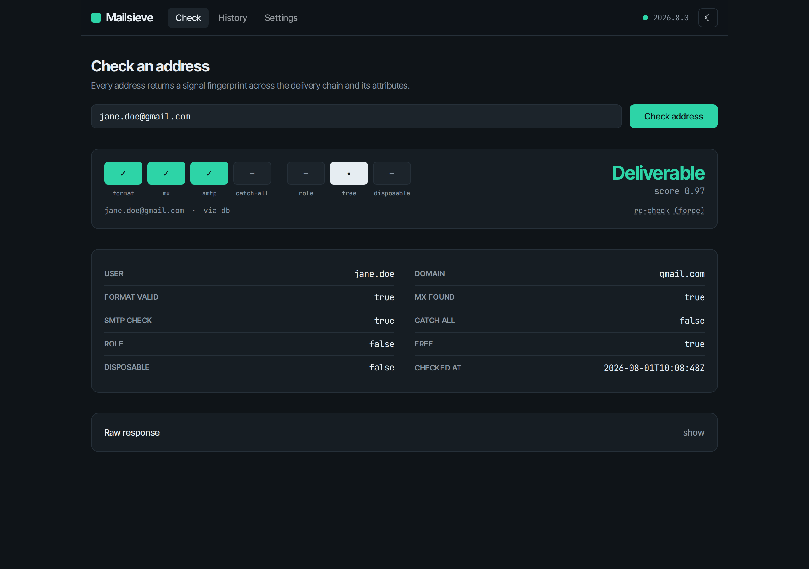
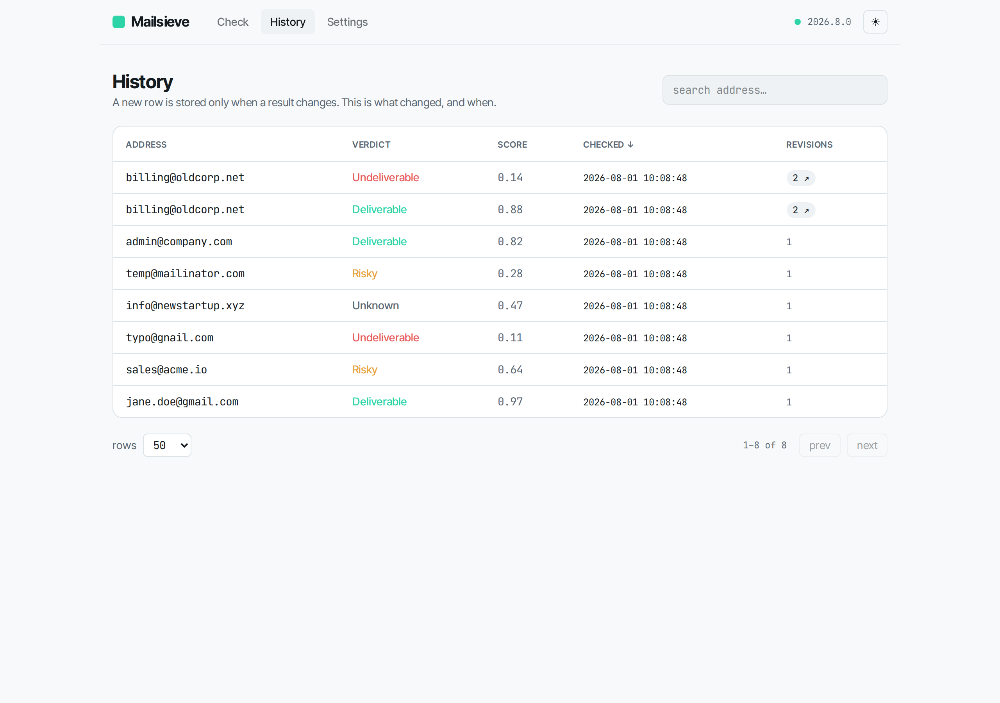
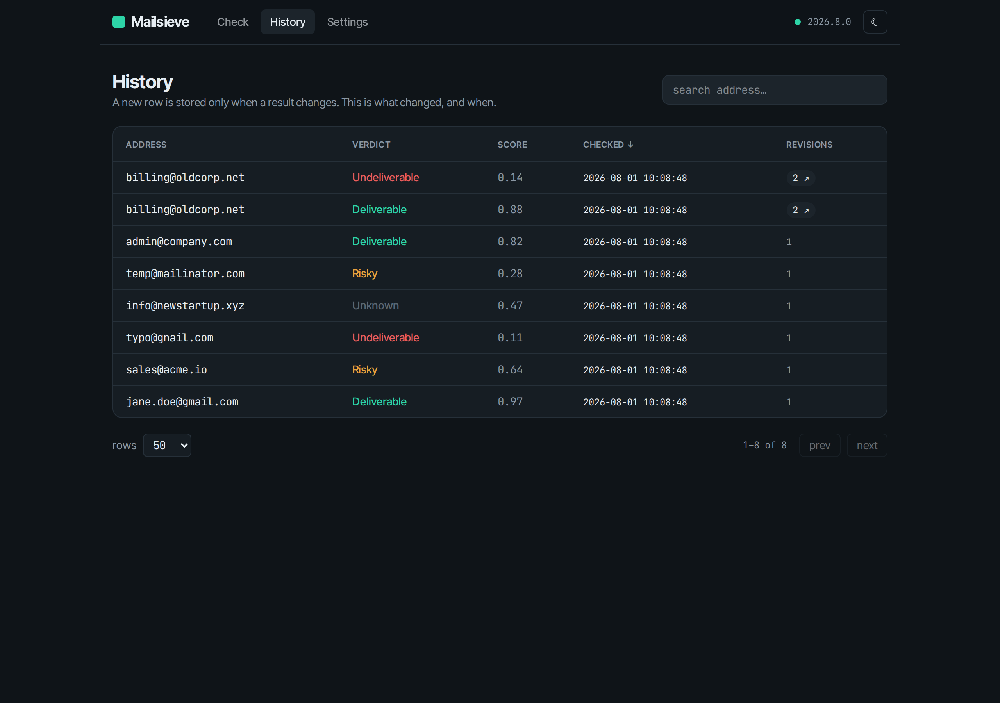
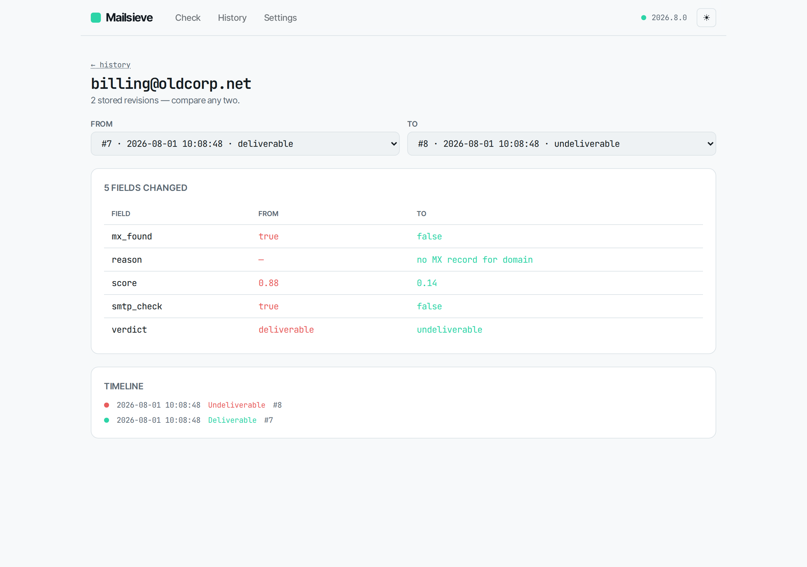
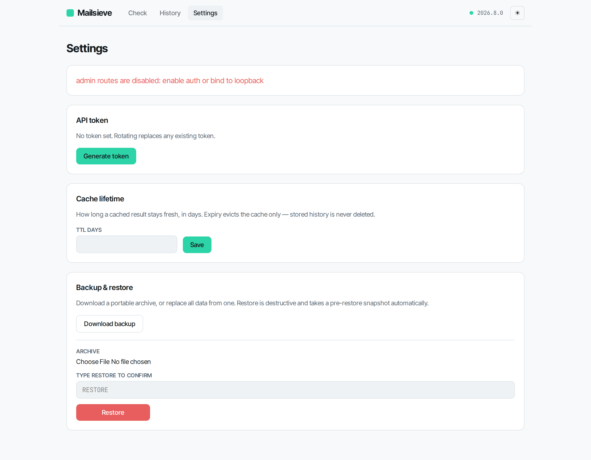
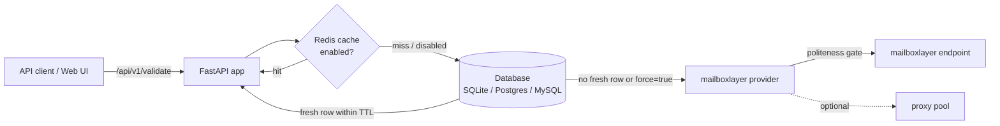

# Mailsieve

[](https://github.com/t0mer/Mailsieve/actions/workflows/ci.yml)
[](https://hub.docker.com/r/techblog/mailsieve)
[](LICENSE)

Self-hosted email validation API. Mailsieve verifies addresses through mailboxlayer's
verification endpoint, then stores, (optionally) caches and serves the results through a REST
API and a web UI with history and revision diffs.

It is built for people who want a small, self-hosted "is this address deliverable?" service
with a permanent, append-only record of how each address's result has changed over time.

> [!IMPORTANT]
> Mailsieve talks to a third-party service (mailboxlayer). **You are responsible for making
> sure your use complies with mailboxlayer's terms of service** and any applicable law. See
> [How it works](#how-it-works) for exactly what the provider does.

## Table of contents

- [Features](#features)
- [Screens](#screens)
- [How it works](#how-it-works)
- [Requirements](#requirements)
- [Installation](#installation)
- [Configuration](#configuration)
- [Authentication](#authentication)
- [API reference](#api-reference)
- [Backup and restore](#backup-and-restore)
- [Database and migrations](#database-and-migrations)
- [Security notes](#security-notes)
- [Troubleshooting](#troubleshooting)
- [Development](#development)
- [Contributing](#contributing)
- [License](#license)

## Features

- **Email validation API**: `POST /api/v1/validate` or `GET /api/v1/validate/{email}`, returning
  format, MX, SMTP, catch-all, role, free and disposable signals, a `score`, a
  `did_you_mean` suggestion, and a derived **verdict** (`deliverable`, `undeliverable`,
  `risky`, `unknown`) with a reason.
- **Results are reused, not re-fetched**: a stored result younger than the TTL (default
  30 days) is served from the database; `force=true` bypasses it.
- **Append-only history**: a re-check writes a new row **only when the result changed**, so
  history is a record of what changed and when. Every check is also recorded as a lightweight
  verification event.
- **Revision diff**: compare any two stored revisions of an address, with a timeline.
- **Web UI** (React): check page with a "signal strip" per address, paginated/sortable/
  searchable history, diff view, settings, light and dark themes.
- **Three database backends**: SQLite (default), PostgreSQL, MySQL. Schema migrations
  (Alembic) run automatically on startup.
- **Optional Redis cache** in front of the database (disabled by default), with graceful
  degradation: a Redis outage never fails a request.
- **Portable backup/restore**: a gzipped JSON archive that restores across SQLite, PostgreSQL
  and MySQL, with checksum verification and an automatic pre-restore snapshot.
- **Auth**: optional API token (stored bcrypt-hashed, shown once) and optional HTTP Basic auth
  for admin routes, plus an exposure guard that disables admin routes when they would be
  reachable unauthenticated from the network.
- **Client rate limit** on validation (60 requests/minute per token or client IP).
- **Health endpoint** with database and upstream reachability; OpenAPI docs at `/api/docs`.
- Multi-arch Docker image (`linux/amd64`, `linux/arm64`) running as a non-root user.

## Screens

### Check

Every address renders as a **signal strip**: a fixed row of cells across the delivery chain
(`format · mx · smtp · catch-all`) and its attributes (`role · free · disposable`), so each
address produces a recognisable left-to-right fingerprint. The verdict sits large in its own
colour, with `score` as a secondary figure. A "re-check (force)" action bypasses stored
results, and the raw JSON response can be expanded.




### History

Results are stored append-only and paginated server-side (page size up to 250), with search by
address and sorting by address, verdict, score or check time. A revision badge links to the
diff for any address that has more than one stored revision.




### Diff

Two revisions side by side, changed fields highlighted, with a timeline of every revision.
This is why the table is append-only.



### Settings

Generate/rotate the API token (shown once), adjust the result TTL, download a backup or
restore one, and see the active environment (database type, Redis, auth modes). Auth modes
and the bind address are set in config, not in the UI. The Settings page uses the
[admin routes](#authentication), so it is subject to the exposure guard.



The header shows a health dot (refreshed every 60 seconds) with the running version, and a
light/dark theme toggle.

## How it works


```mermaid
flowchart LR
    C[API client / Web UI] -->|/api/v1/validate| A[FastAPI app]
    A --> R{Redis cache<br/>enabled?}
    R -->|hit| A
    R -->|miss / disabled| D[(Database<br/>SQLite / Postgres / MySQL)]
    D -->|fresh row within TTL| A
    D -->|no fresh row or force=true| P[mailboxlayer provider]
    P -->|politeness gate| U[mailboxlayer endpoint]
    P -.->|optional| X[proxy pool]
```

### Validation flow

1. The address is normalised: whitespace trimmed and the domain lower-cased (the local part is
   kept as-is). Plus-addressing (`user+tag@example.com`) is passed through intact.
2. If Redis is enabled and `force` is not set, a cached result is returned
   (`"source": "cache"`, `"cached": true`).
3. Otherwise the newest stored row for the address is used if it is younger than
   `validation.ttl_days` (`"source": "db"`).
4. Otherwise the provider is called (`"source": "provider"`). The result is appended to the
   database only if it differs from the latest stored result (volatile fields `checked_at`,
   `cached` and `source` are ignored), then cached in Redis for `ttl_days`.
5. Checks answered from the database or the provider are recorded as a verification event;
   Redis cache hits are not recorded.

Addresses without an `@`, with an empty local part, or with no `.` in the domain are rejected
locally as `undeliverable` without any upstream request.

### Verdict rules

The verdict is derived from the upstream fields, in this order:

| Condition | Verdict | Reason |
|-----------|---------|--------|
| `format_valid` is `false` | `undeliverable` | invalid address format |
| `mx_found` is `false` | `undeliverable` | no MX record for domain |
| `catch_all` or `disposable` is `true` | `risky` | catch-all or disposable domain |
| `smtp_check` is `true` | `deliverable` | — |
| anything else | `unknown` | insufficient signals from upstream |

`null` and `false` are preserved exactly as the upstream sends them (`catch_all: null` means
"undetermined", not "no"). An empty `did_you_mean` becomes `null`.

### The mailboxlayer provider

All upstream communication lives in `app/providers/mailboxlayer/`. It does **not** use a
mailboxlayer API access key and has no setting for one. At a high level:

- **Request token** (`secret.py`, `provider.py`): obtains a short-lived request token from the
  public website, caches it (for `secret.ttl_minutes`, default 30), and retries once with a
  fresh token if a response looks rejected.
- **Mapping** (`mapping.py`): converts the upstream JSON to the Mailsieve response and derives
  the verdict (see above).
- **Politeness** (`politeness.py`): one gate shared by every caller in the process. It caps
  in-flight upstream verification requests at `politeness.max_concurrent` (default 4) and
  spaces the start of consecutive requests by at least `politeness.min_interval_seconds`
  (default 0.5 s). It limits how much load Mailsieve puts on the upstream service; it is
  separate from the client-facing rate limit.
- **Network path** (`client.py`, `proxies.py`, `useragents.py`): requests may go through a
  configurable public proxy list with a direct fallback, and send a varying User-Agent header.
  Failed attempts are retried up to `request.max_retries` times with exponential backoff.

`proxies.enabled: false` sends all verification requests directly from your host;
`proxies.enabled: false` together with `proxies.fallback_direct: false` is rejected at startup
because no request could ever be made.

> [!WARNING]
> **Terms of service.** This provider depends on an undocumented website endpoint, not a
> published API contract, and routes traffic through third-party free proxies by default. The
> author reports that this usage was disclosed to mailboxlayer and confirmed as permitted
> <!-- TODO: verify -->; that statement does not cover your deployment. Review mailboxlayer's
> terms of service before running Mailsieve and configure it accordingly. Free public proxies
> are operated by unknown third parties; with the default `https` base URL the request is
> tunnelled through them with TLS, but they still see the destination host and your traffic
> pattern. The endpoint can change without notice; `/api/v1/health` reports whether the
> request secret can currently be obtained.

## Requirements

- **Docker** (recommended), or **Python 3.11+** (the image uses 3.12) and **Node.js 22** to
  build the UI from source.
- Outbound HTTPS access to `mailboxlayer.com` (and to the proxy list source, if proxies are
  enabled).
- Optional: **Redis** (cache), **PostgreSQL** or **MySQL** instead of SQLite.

## Installation

### Docker Compose (recommended)

The repository's [`docker-compose.yml`](docker-compose.yml) runs Mailsieve with SQLite and a
Redis container, and contains commented-out PostgreSQL and MySQL services.

```bash
mkdir -p config data
cp config.example.yaml config/config.yaml   # optional; built-in defaults apply without it
sudo chown -R 1000:1000 config data         # the container runs as uid/gid 1000
docker compose up -d
```

Open <http://localhost:8080> for the UI and <http://localhost:8080/api/docs> for the API docs.

Notes:

- Redis is **disabled by default** (`redis.enabled: false`), so the bundled Redis service is
  unused until you set `MAILSIEVE_REDIS__ENABLED: "true"` (the compose file already points
  `MAILSIEVE_REDIS__URL` at it).
- To use PostgreSQL or MySQL, uncomment the service and set `MAILSIEVE_DATABASE__TYPE` and the
  matching connection variables on the `mailsieve` service, as described in the compose file.
- With the default config the service binds all interfaces and auth is off, so the **admin
  routes (Settings, backup, restore) are disabled** until you enable auth. See
  [Authentication](#authentication).

### Docker

```bash
mkdir -p config data
sudo chown -R 1000:1000 config data   # the container runs as uid/gid 1000
docker run -d --name mailsieve \
  -p 8080:8080 \
  -v "$PWD/data:/data" \
  -v "$PWD/config:/config" \
  techblog/mailsieve:latest
```

Published tags on Docker Hub: `latest` and `2026.8.0` (`linux/amd64`, `linux/arm64`).
Volumes: `/data` (SQLite database and `backups/`) and `/config` (`config.yaml`). The image
listens on port 8080 and has a healthcheck on `/api/v1/health`.

To build the image yourself: `docker build -t techblog/mailsieve .` (or `make docker`). The
`BACKENDS` build argument (default `all`) selects which optional database drivers are
installed (`postgres`, `mysql` or `all`).

### From source

```bash
git clone https://github.com/t0mer/Mailsieve.git
cd Mailsieve
pip install -e ".[all,dev]"        # or ".[postgres]" / ".[mysql]" / "." for SQLite only
make fe-build                      # builds the UI into app/static

cp config.example.yaml config.yaml
export MAILSIEVE_CONFIG_FILE=$PWD/config.yaml
export MAILSIEVE_DATABASE__SQLITE__PATH=$PWD/data/mailsieve.db
export MAILSIEVE_BACKUP__DIRECTORY=$PWD/data/backups
mkdir -p data/backups
uvicorn app.main:app --host 127.0.0.1 --port 8080
```

The defaults point at `/config/config.yaml`, `/data/mailsieve.db` and `/data/backups` (container
paths), so override them as shown when running outside Docker; otherwise a restore fails when it
tries to write its pre-restore snapshot. Migrations run automatically on startup. Without a UI
build, `/` returns `{"detail": "UI not built"}`; the API still works.

## Configuration

Settings come from three layers. Precedence, highest first:

1. **Environment variables** with the `MAILSIEVE_` prefix; nested keys are joined with `__`
   (for example `database.postgres.host` → `MAILSIEVE_DATABASE__POSTGRES__HOST`).
2. **YAML file** at `MAILSIEVE_CONFIG_FILE` (default `/config/config.yaml`). A missing file is
   fine; malformed YAML or an incoherent config stops startup.
3. **Built-in defaults** (listed below; see [`config.example.yaml`](config.example.yaml)).

Two values are **stored in the database** rather than in the file or environment: the result
TTL, which a value saved with `PUT /api/v1/settings` overrides `validation.ttl_days`, and the API
token hash, which exists only in the database.

### Environment-only variables

| Variable | Default | Description |
|----------|---------|-------------|
| `MAILSIEVE_CONFIG_FILE` | `/config/config.yaml` | Path to the YAML config file. |
| `MAILSIEVE_VERSION` | set at image build time | Version reported by `/api/v1/health` and the UI. Falls back to the installed package version. |

### Settings

| YAML key | Environment variable | Default | Description |
|----------|----------------------|---------|-------------|
| `server.host` | `MAILSIEVE_SERVER__HOST` | `0.0.0.0` | Used by the admin exposure guard and shown in the settings view. It does **not** change the uvicorn bind address; the Docker image always binds `0.0.0.0:8080`. |
| `server.port` | `MAILSIEVE_SERVER__PORT` | `8080` | Shown in the settings view only; the listening port is set by the uvicorn command line. |
| `server.base_path` | `MAILSIEVE_SERVER__BASE_PATH` | `""` | Present in the config but not used by the code. |
| `database.type` | `MAILSIEVE_DATABASE__TYPE` | `sqlite` | `sqlite`, `postgres` or `mysql`. |
| `database.sqlite.path` | `MAILSIEVE_DATABASE__SQLITE__PATH` | `/data/mailsieve.db` | SQLite file path. |
| `database.postgres.host` | `MAILSIEVE_DATABASE__POSTGRES__HOST` | `localhost` | PostgreSQL host. |
| `database.postgres.port` | `MAILSIEVE_DATABASE__POSTGRES__PORT` | `5432` | PostgreSQL port. |
| `database.postgres.user` | `MAILSIEVE_DATABASE__POSTGRES__USER` | `mailsieve` | PostgreSQL user. |
| `database.postgres.password` | `MAILSIEVE_DATABASE__POSTGRES__PASSWORD` | `""` | PostgreSQL password. |
| `database.postgres.database` | `MAILSIEVE_DATABASE__POSTGRES__DATABASE` | `mailsieve` | PostgreSQL database name. |
| `database.postgres.sslmode` | `MAILSIEVE_DATABASE__POSTGRES__SSLMODE` | `prefer` | Present in the config but not currently passed to the driver. |
| `database.mysql.host` | `MAILSIEVE_DATABASE__MYSQL__HOST` | `localhost` | MySQL host. |
| `database.mysql.port` | `MAILSIEVE_DATABASE__MYSQL__PORT` | `3306` | MySQL port. |
| `database.mysql.user` | `MAILSIEVE_DATABASE__MYSQL__USER` | `mailsieve` | MySQL user. |
| `database.mysql.password` | `MAILSIEVE_DATABASE__MYSQL__PASSWORD` | `""` | MySQL password. |
| `database.mysql.database` | `MAILSIEVE_DATABASE__MYSQL__DATABASE` | `mailsieve` | MySQL database name. |
| `database.pool_size` | `MAILSIEVE_DATABASE__POOL_SIZE` | `5` | Connection pool size (PostgreSQL/MySQL). |
| `database.echo` | `MAILSIEVE_DATABASE__ECHO` | `false` | Log SQL statements. |
| `redis.enabled` | `MAILSIEVE_REDIS__ENABLED` | `false` | Put a Redis cache in front of the database. |
| `redis.url` | `MAILSIEVE_REDIS__URL` | `redis://localhost:6379/0` | Redis URL. |
| `redis.password` | `MAILSIEVE_REDIS__PASSWORD` | `""` | Redis password (optional). |
| `redis.key_prefix` | `MAILSIEVE_REDIS__KEY_PREFIX` | `mailsieve:v1` | Key prefix; keys are `<prefix>:result:<sha256(email)>`. |
| `validation.ttl_days` | `MAILSIEVE_VALIDATION__TTL_DAYS` | `30` | How long a stored result is reused before the provider is called again; also the Redis entry lifetime. Expiry never deletes database rows. Overridden by a value saved in Settings. |
| `mailboxlayer.base_url` | `MAILSIEVE_MAILBOXLAYER__BASE_URL` | `https://mailboxlayer.com` | Upstream base URL. |
| `mailboxlayer.secret_url` | `MAILSIEVE_MAILBOXLAYER__SECRET_URL` | internal; see `config.example.yaml` | Page the request token is obtained from. |
| `mailboxlayer.secret_input_name` | `MAILSIEVE_MAILBOXLAYER__SECRET_INPUT_NAME` | internal; see `config.example.yaml` | Internal upstream detail; leave at the default. |
| `mailboxlayer.api_path` | `MAILSIEVE_MAILBOXLAYER__API_PATH` | internal; see `config.example.yaml` | Internal upstream detail; leave at the default. |
| `mailboxlayer.smtp` | `MAILSIEVE_MAILBOXLAYER__SMTP` | `1` | Ask the upstream to include an SMTP check. |
| `mailboxlayer.secret.ttl_minutes` | `MAILSIEVE_MAILBOXLAYER__SECRET__TTL_MINUTES` | `30` | How long the request token is reused. |
| `mailboxlayer.secret.refresh_on_reject` | `MAILSIEVE_MAILBOXLAYER__SECRET__REFRESH_ON_REJECT` | `true` | Retry once with a fresh token when a response looks rejected. |
| `mailboxlayer.proxies.enabled` | `MAILSIEVE_MAILBOXLAYER__PROXIES__ENABLED` | `true` | Use the free proxy pool for verification requests. |
| `mailboxlayer.proxies.source_url` | `MAILSIEVE_MAILBOXLAYER__PROXIES__SOURCE_URL` | ProxyScrape free list URL | JSON proxy list to download (see `config.example.yaml`). |
| `mailboxlayer.proxies.protocol` | `MAILSIEVE_MAILBOXLAYER__PROXIES__PROTOCOL` | `http` | Only list entries with this protocol are kept. |
| `mailboxlayer.proxies.max` | `MAILSIEVE_MAILBOXLAYER__PROXIES__MAX` | `200` | Maximum proxies kept from the list. |
| `mailboxlayer.proxies.refresh_minutes` | `MAILSIEVE_MAILBOXLAYER__PROXIES__REFRESH_MINUTES` | `10` | Proxy list refresh interval. |
| `mailboxlayer.proxies.fallback_direct` | `MAILSIEVE_MAILBOXLAYER__PROXIES__FALLBACK_DIRECT` | `true` | Send requests directly when a proxy fails or none is available. |
| `mailboxlayer.user_agents_file` | `MAILSIEVE_MAILBOXLAYER__USER_AGENTS_FILE` | `""` | File with one user-agent per line (`#` comments allowed); empty uses the bundled list. |
| `mailboxlayer.request.timeout_seconds` | `MAILSIEVE_MAILBOXLAYER__REQUEST__TIMEOUT_SECONDS` | `15` | Timeout for direct attempts (proxy attempts are capped at 6 s). |
| `mailboxlayer.request.max_retries` | `MAILSIEVE_MAILBOXLAYER__REQUEST__MAX_RETRIES` | `5` | Total attempts per verification request. |
| `mailboxlayer.request.backoff_seconds` | `MAILSIEVE_MAILBOXLAYER__REQUEST__BACKOFF_SECONDS` | `0.5` | Base for exponential backoff between attempts. |
| `mailboxlayer.politeness.max_concurrent` | `MAILSIEVE_MAILBOXLAYER__POLITENESS__MAX_CONCURRENT` | `4` | Maximum in-flight upstream verification requests (process-wide). |
| `mailboxlayer.politeness.min_interval_seconds` | `MAILSIEVE_MAILBOXLAYER__POLITENESS__MIN_INTERVAL_SECONDS` | `0.5` | Minimum spacing between upstream request starts. |
| `auth.api.enabled` | `MAILSIEVE_AUTH__API__ENABLED` | `false` | Require an API token on validation and history routes. |
| `auth.ui.enabled` | `MAILSIEVE_AUTH__UI__ENABLED` | `false` | Accept HTTP Basic auth on admin routes. Requires `auth.ui.password`. |
| `auth.ui.username` | `MAILSIEVE_AUTH__UI__USERNAME` | `admin` | Basic auth username. |
| `auth.ui.password` | `MAILSIEVE_AUTH__UI__PASSWORD` | `""` | **bcrypt hash** of the Basic auth password (not plaintext). |
| `backup.directory` | `MAILSIEVE_BACKUP__DIRECTORY` | `/data/backups` | Where pre-restore snapshots are written. |
| `backup.max_upload_mb` | `MAILSIEVE_BACKUP__MAX_UPLOAD_MB` | `256` | Maximum restore upload size. |
| `logging.level` | `MAILSIEVE_LOGGING__LEVEL` | `INFO` | `DEBUG`, `INFO`, `WARNING` or `ERROR`. |
| `logging.json` | `MAILSIEVE_LOGGING__JSON` | `false` | Emit JSON log lines. |

Startup fails if `auth.ui.enabled` is `true` with an empty `auth.ui.password`, or if both
`mailboxlayer.proxies.enabled` and `mailboxlayer.proxies.fallback_direct` are `false`.

## Authentication

Routes fall into three groups:

| Group | Routes | Access |
|-------|--------|--------|
| Open | `GET /api/v1/health`, `/api/docs`, `/api/openapi.json`, the UI | Always open. |
| API | `/api/v1/validate*`, `/api/v1/history*` | Open when `auth.api.enabled` is `false`; otherwise a valid API token is required. |
| Admin | `/api/v1/settings*`, `/api/v1/backup`, `/api/v1/restore`, `/api/v1/metrics` | See the exposure guard below. When any auth mode is enabled: a valid API token (if API auth is on) or valid Basic credentials (if UI auth is on). When both are off: open, but only on a loopback bind. |

**API token.** Send it as `Authorization: Bearer <token>` or `X-API-Key: <token>`. The token is
generated in the UI (Settings), with `POST /api/v1/settings/token`, or with
`python scripts/set_token.py` from a source checkout (the script is not included in the Docker
image; a token written by the script takes effect only after the app restarts). Only a bcrypt hash is stored (in the `app_settings` table); the plaintext is shown
once. Generating a new token replaces the previous one.

**Basic auth.** `auth.ui.password` must be a bcrypt hash, for example:

```bash
python -c "import bcrypt, getpass; print(bcrypt.hashpw(getpass.getpass().encode(), bcrypt.gensalt()).decode())"
```

Basic auth is accepted only on the admin routes.

**Exposure guard.** When both auth modes are disabled and `server.host` is not a loopback
address (e.g. `localhost`, `127.0.0.1` or anything in `127.0.0.0/8`, `::1`), all admin routes return `403` ("admin routes are
disabled: enable auth or bind to loopback") and a warning is logged at startup. This prevents
an unauthenticated restore endpoint (which replaces the whole database) from being reachable
over the network. The guard uses the configured `server.host`, not the socket uvicorn actually
listens on, so keep `server.host` consistent with the real bind address.

**Web UI and auth.** The bundled web UI does not send an API token or Basic credentials:

- With `auth.api` on, the Check and History pages get `401`.
- With either auth mode on, the Settings page, backup and restore get `401`.
- With auth off and a non-loopback `server.host`, the Settings page, backup and restore get `403`.

So on a default Docker deployment the Settings page cannot be used from the browser; perform
admin actions with `curl` and credentials (see [Backup and restore](#backup-and-restore)).

### Rate limiting

`/api/v1/validate` (both forms) is limited to **60 requests per minute per client** (token or
IP). It is an in-memory fixed-window limiter (per process, reset on restart, not configurable).
Enable API auth whenever the service is exposed beyond a trusted network. Exceeding it returns
`429 rate limit exceeded`. This is independent of the upstream politeness gate, which always
applies.

## API reference

Interactive docs: `/api/docs` (Swagger UI). OpenAPI schema: `/api/openapi.json`.
All routes are under `/api/v1`.

| Method | Path | Auth | Description |
|--------|------|------|-------------|
| `POST` | `/validate?force=false` | API + rate limit | Validate the address in the JSON body `{"email": "..."}`. |
| `GET` | `/validate/{email}?force=false` | API + rate limit | Same, with the address in the path. |
| `GET` | `/history` | API | Paginated history. Query: `limit` (default 50, clamped to 250), `offset` (default 0), `sort` (`created_at` default, `checked_at`, `email`, `verdict`, `reason`, `provider`, `score`), `order` (`asc`/`desc`, default `desc`), `search` (substring match on the address). |
| `GET` | `/history/{email}` | API | All stored revisions for an address, newest first. |
| `GET` | `/history/{email}/diff?a={id}&b={id}` | API | Diff two revisions (by row id) plus a timeline; `404` if a revision does not belong to the address. |
| `GET` | `/health` | Open | Status, version, database and upstream reachability. |
| `GET` | `/metrics` | Admin | Row counts: `validation_results`, `verification_events` (JSON, not Prometheus format). |
| `GET` | `/settings` | Admin | Current settings with secrets masked. |
| `PUT` | `/settings` | Admin | Update the result TTL: `{"ttl_days": 14}` (≥ 1). Takes effect immediately and persists. |
| `POST` | `/settings/token` | Admin | Generate or rotate the API token; returns it once. |
| `DELETE` | `/settings/token` | Admin | Remove the API token. |
| `POST` | `/backup` | Admin | Download a backup archive (`application/gzip`). |
| `POST` | `/restore` | Admin | Restore from an archive (multipart: `file`, `confirm_token=RESTORE`). **Destructive.** |

Validation errors from the upstream (request secret unavailable or all attempts failed) return
`502` with `upstream verification endpoint is unreachable: …`.

### Example: validate

```bash
curl -s -X POST http://localhost:8080/api/v1/validate \
  -H "Content-Type: application/json" \
  -H "Authorization: Bearer $MAILSIEVE_TOKEN" \
  -d '{"email": "someone@example.com"}'
```

Response shape (`ValidationResponse`):

```json
{
  "email": "someone@example.com",
  "email_raw": "someone@example.com",
  "user": "someone",
  "domain": "example.com",
  "format_valid": true,
  "mx_found": true,
  "smtp_check": false,
  "catch_all": null,
  "role": false,
  "disposable": false,
  "free": false,
  "did_you_mean": null,
  "score": 0.64,
  "verdict": "unknown",
  "reason": "insufficient signals from upstream",
  "provider": "mailboxlayer",
  "checked_at": "2026-08-01T10:00:00Z",
  "cached": false,
  "source": "provider"
}
```

`email` is the normalised address and `email_raw` the address as submitted. `source` is
`provider`, `db` or `cache`. The values above are illustrative.

### Example: health

```bash
curl -s http://localhost:8080/api/v1/health
```

```json
{
  "status": "ok",
  "version": "2026.8.0",
  "database": {"ok": true, "type": "sqlite"},
  "redis": {"enabled": false},
  "provider": {"name": "mailboxlayer", "reachable": true, "secret_ok": true, "proxy_count": 0, "detail": ""}
}
```

`status` is `degraded` when the database or the upstream is unreachable; the endpoint still
returns HTTP 200. The upstream counts as reachable when the request secret can be fetched and
either proxies are available or direct fallback is enabled. Calling it may fetch the request
secret if the cached one has expired.

## Backup and restore

A backup is a gzipped tar with two members: `manifest.json` (schema version, creation time,
source backend, row counts, SHA-256 of the data) and `data.json` (all rows of
`validation_results`, `verification_events` and `app_settings`). Because it is JSON, not a raw
database file, it can be restored into a different backend.

```bash
# Backup
curl -s -X POST -H "Authorization: Bearer $MAILSIEVE_TOKEN" \
  -o mailsieve.mailsieve-backup.gz http://localhost:8080/api/v1/backup

# Restore (replaces ALL data)
curl -s -X POST -H "Authorization: Bearer $MAILSIEVE_TOKEN" \
  -F file=@mailsieve.mailsieve-backup.gz -F confirm_token=RESTORE \
  http://localhost:8080/api/v1/restore
```

Restore checks, in order: the upload size (`backup.max_upload_mb`, enforced while the upload
streams; `413` if exceeded), the confirmation token, archive members (only the two expected regular files; absolute or `..` paths are rejected),
the checksum and the schema version. It then writes a pre-restore snapshot to
`backup.directory` (`pre-restore-<timestamp>.mailsieve-backup.gz`) and replaces all rows in one
transaction. The archive includes the API token hash, so the token from the backed-up instance
becomes active after restore. A TTL saved in Settings is restored to the database but only
takes effect after a restart.

## Database and migrations

Tables:

- `validation_results`: append-only results (`email`, JSON `result`, `result_hash`,
  `created_at`). A new row is written only when the result hash changes.
- `verification_events`: one row per database or provider check; Redis cache hits are not
  recorded (`email`, `result_id`, `checked_at`, `source`,
  `cache_hit`).
- `app_settings`: key/value store for the API token hash and the saved TTL.

Rows in `validation_results` and `verification_events` are never updated or deleted by normal
operation (only by restore). `app_settings` rows are updated when the TTL is saved or the token
rotated, and `DELETE /api/v1/settings/token` removes the token row. Alembic migrations in
`alembic/versions/` run automatically at startup; `make migrate` (`alembic upgrade head`)
applies them manually using the same configuration.

## Security notes

- **Do not expose admin routes without auth.** Restore replaces the entire database. Enable
  API and/or Basic auth before exposing Mailsieve beyond localhost, and put it behind a
  TLS-terminating reverse proxy; the app itself serves plain HTTP.
- **Protect secrets.** Keep database and Redis passwords out of version control (use
  environment variables or a protected `config.yaml`). Store only a bcrypt hash in
  `auth.ui.password`. Treat the API token like a password; it is shown only once.
- **Third-party proxies.** With the default settings, verification requests are routed
  through free public proxies run by unknown parties. Keep `mailboxlayer.base_url` on `https`
  so the request contents stay encrypted, and disable `mailboxlayer.proxies.enabled` if
  routing through unknown proxies is not acceptable for you.
- **Personal data.** Validated addresses and results are stored permanently in the database and
  in backups. Handle them according to your privacy obligations.
- **Backups contain credential hashes.** Store backup archives securely.
- The container runs as a non-root user (uid 1000).

## Troubleshooting

- **Settings page shows "admin routes are disabled: enable auth or bind to loopback".** Auth is
  off and `server.host` is not loopback (the default in Docker). Enable `auth.api` and/or
  `auth.ui` and call the admin routes with credentials. See [Authentication](#authentication).
- **All API calls return 401 after enabling `auth.api` with no token yet.** Create a token first:
  enable `auth.ui` and call `POST /api/v1/settings/token` with Basic auth
  (`curl -u admin:<password> -X POST http://localhost:8080/api/v1/settings/token`), or run
  `python scripts/set_token.py` against the same database from a source checkout, then restart
  the app so it picks up the new token.
- **Validation returns 502.** The request secret could not be fetched or every attempt failed.
  Check `/api/v1/health` (`provider.detail`) and the logs. The upstream page or endpoint may
  have changed shape.
- **Validation is slow.** Free proxies are often dead or slow. Each failed proxy attempt can take
  up to 6 seconds before the direct fallback. Setting
  `MAILSIEVE_MAILBOXLAYER__PROXIES__ENABLED=false` sends requests directly.
- **429 rate limit exceeded.** More than 60 validation requests per minute from one client.
- **Startup fails with a config error.** See the coherence rules at the end of
  [Configuration](#configuration), and check YAML syntax.
- **`/` returns `{"detail": "UI not built"}`.** Run `make fe-build` (source installs only; the
  Docker image already includes the UI).
- **Permission denied on `/data` or `/config`.** Bind-mounted host directories must be writable
  by uid 1000.

## Development

Project layout:

```text
app/
  api/            routes (validate, history, settings, admin), auth gates, rate limiter
  auth/           API token hashing, Basic auth, exposure guard
  cache/          Redis cache
  db/             models, repository, session, startup migrations
  providers/      provider protocol and the mailboxlayer implementation
  schemas/        request/response models
  services/       validation, history, backup
  data/           bundled user-agent list
  static/         built UI (generated)
alembic/          migrations
frontend/         React + TypeScript + Vite + Tailwind UI
scripts/          set_token.py, next-version.sh
tests/            unit and integration tests
```

Makefile targets:

| Target | Description |
|--------|-------------|
| `make install` | `pip install -e ".[all,dev]"` |
| `make dev` | Run the API with reload on `0.0.0.0:8080` |
| `make fe-dev` | Vite dev server (proxies `/api` to `localhost:8080`) |
| `make fe-build` | Build the UI into `app/static` |
| `make lint` / `make fmt` | Ruff check / Ruff format + fix |
| `make type` | mypy (strict) |
| `make test` | Unit tests (`pytest -m "not integration"`) |
| `make test-int` | Integration tests (need live PostgreSQL, MySQL and Redis) |
| `make migrate` | `alembic upgrade head` |
| `make docker` | Build `techblog/mailsieve:<version>` and `:latest` for the local arch |
| `make docker-multi` | Build and push `linux/amd64` + `linux/arm64` |
| `make clean` | Remove caches and coverage output |

GitHub Actions workflows:

- **CI** (`ci.yml`, push to `main` and pull requests): Ruff, mypy, unit tests with coverage;
  integration tests against PostgreSQL 16, MySQL 8 and Redis 7; UI build.
- **Docker** (`docker.yml`, manual): builds `linux/amd64` and `linux/arm64`, pushes
  `techblog/mailsieve:latest` and `:<version>` to Docker Hub, then tags the commit. The version
  is `YYYY.M.PATCH`, computed by `scripts/next-version.sh` unless given as input.
- **Publish to GHCR** (`publish-ghcr.yml`, manual): builds `linux/amd64`, `linux/arm64` and
  `linux/arm/v7` and pushes `ghcr.io/t0mer/mailsieve`. No GHCR image is published yet.
- **Security** (`security.yml`, after a merged PR, weekly on Monday 03:00 UTC, and manual):
  Trivy filesystem and image scans (SARIF upload), Snyk and SonarQube.

## Contributing

Issues and pull requests are welcome. Please run `make lint type test` (and `make fe-build` for
UI changes) before opening a pull request, and keep changes to the upstream integration inside
`app/providers/mailboxlayer/`.

## License

Licensed under the [Apache License 2.0](LICENSE).
